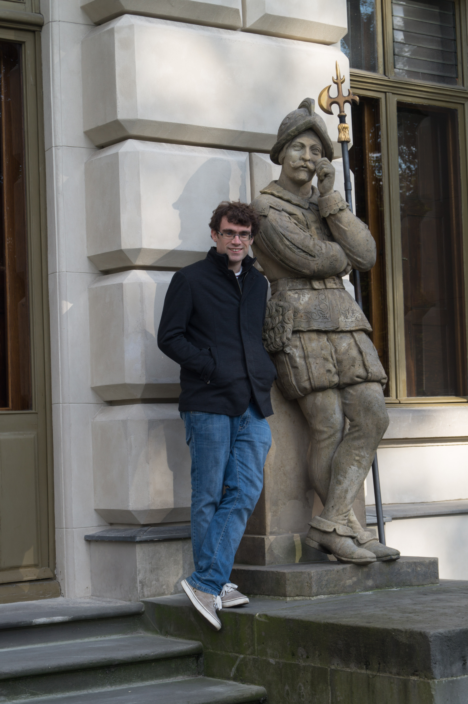

---
#
# By default, content added below the "---" mark will appear in the home page
# between the top bar and the list of recent posts.
# To change the home page layout, edit the _layouts/home.html file.
# See: https://jekyllrb.com/docs/themes/#overriding-theme-defaults
#
layout: home
---

<!--  -->

Goethe-Universität, Frankfurt
 
Institut für Linguistik (Hauspostfach 29)
 
Norbert-Wollheim-Platz 1
 
60629 Frankfurt-am-Main
 
Germany
 
 
p.smith [at] em.uni-frankfurt.de

